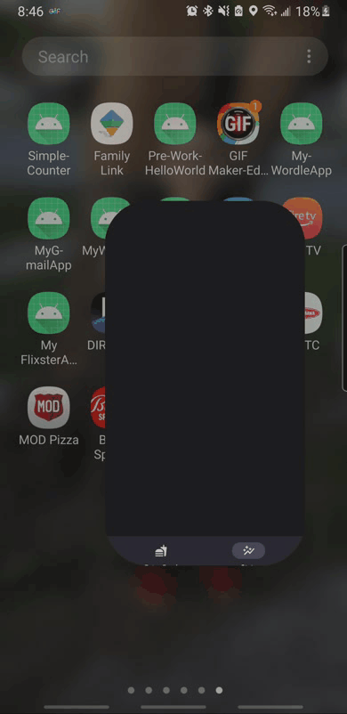

# Android Project 6 - *MyBitFitApp*

Submitted by: **Jesus Rosas**

**MyBitFitApp** is a health metrics app that allows users to track ... [TODO] 

Time spent: **25+** hours spent in total

## Required Features

The following **required** functionality is completed:

- [x] **Use at least 2 Fragments**
- [x] **Create a new dashboard fragment where users can see a summary of their entered data**
- [x] **Use one of the Navigation UI Views (BottomNavigation, Drawer Layout, Top Bar) to move between the fragments**

The following **optional** features are implemented:

- [ ] **Add a more advanced UI (e.g: Graphing) for tracking trends in metrics**
- [ ] **Implement daily notifications to prompt users to fill in their data**

The following **additional** features are implemented:

- [ ] List anything else that you can get done to improve the app functionality!

## Video Walkthrough

Here's a walkthrough of implemented user stories:

